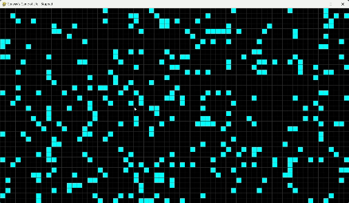

# Conway's Game of Life

This project is an implementation of Conway's Game of Life using Pygame. The Game of Life is a cellular automaton devised by mathematician John Conway. It consists of a grid of cells that evolve through generations based on a set of rules.

## How It Works

- **Grid**: The grid is composed of square cells that can be either alive or dead.
- **Initialization**: You can click on the grid to toggle the state of individual cells.
- **Simulation**: Press the spacebar to start/stop the simulation. Cells evolve according to Conway's rules:
  - Any live cell with two or three live neighbors survives.
  - Any dead cell with exactly three live neighbors becomes a live cell.
  - All other live cells die in the next generation, and all other dead cells stay dead.
- **Controls**:
  - `SPACE`: Start/Stop the simulation
  - `C`: Clear the grid
  - `G`: Generate a random grid

## Installation

1. Ensure you have Python and Pygame installed:
   ```bash
   pip install pygame
2. Clone the repository:
    ```bash
    git clone https://github.com/OmkarJadhav2020/conways-game-of-life.git
    cd conways-game-of-life
3. Run the game:
    ```bash
    python game_of_life.py
DEMO


